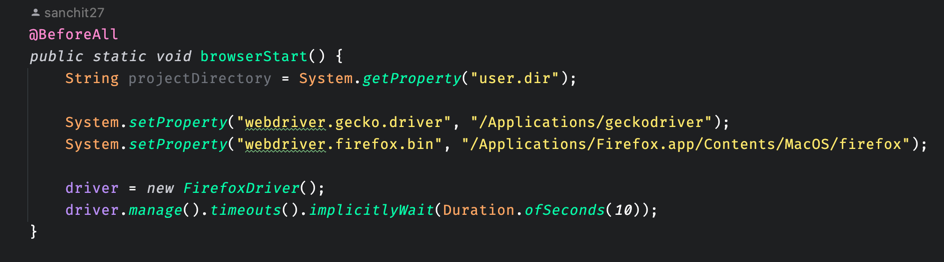

<h3 align="center">Fetch Coding Challenge</h3>

  <p align="center">
    By : Sanchit Bhargava
    </p>


<details>
  <summary>Table of Contents</summary>
  <ol>
    <li><a href="#about-the-project">About The Project</a></li>
    <li><a href="#getting-started">Getting Started</a></li>
    <li><a href="#Installation">Installation</a></li>
    <li><a href="#dockersetup">Docker Setup</a></li>
    <li><a href="#runproject">Run Project</a></li>
    <li><a href="#demovide">Demo Video</a></li> 
   <li><a href="#testcasessnap">Test Cases Snap(Using In device Firefox)</a></li>
   <li><a href="#testcasessnatwop">Test Cases Snap(Using Docker)</a></li>
    <li><a href="#contact">Contact</a></li>
   
  </ol>
</details>

## About The Project

This project consists of automated tests written in Java using Selenium WebDriver. The tests interact with a web-based balance scale game hosted at http://sdetchallenge.fetch.com/. The game simulates a scenario where a user must determine which coin on a balance scale is fake using a limited number of weighings.


### Built With

This section should list any major frameworks/libraries used to bootstrap your project. Leave any add-ons/plugins for the acknowledgements section. Here are a few examples.

<ul style="font-size: medium;">
  <li>Java</li>
  <li>Selenium WebDriver</li>
  <li>JUnit</li>
</ul>

<p align="right">(<a href="#readme-top">back to top</a>)</p>


<!-- GETTING STARTED -->
## Getting Started

To run the tests locally, follow these steps:
### Prerequisites

- **Java Development Kit (JDK):** Ensure JDK 11 or higher is installed on your system.
- **Firefox WebDriver:** Download geckodriver and ensure it's accessible via the system path.
- **Gradle:** Make sure Gradle is installed on your system. Here is the snapshot, just change the path of firefox or driver if needed:



- **Docker (For Windows/linux Users, even mac and other OS devices can also use if needed):** Install Docker and follow the steps given in the README.

### Installation

Below is an example of how you can install the repo:

1. Clone the repo (Below example is using SSH, can also use other methods)
   ```
   git@github.com:sanchit27/fetchcodingexercise.git
   ```
2. Navigate to the project directory:
   ```sh
   fetchcodingexercise/lib/src/main/java/SDETChallengeTest
   ```
3. Update the webdriver.gecko.driver system property in the SDETChallengeTest class with the path(if needed, generally macbook firefox has same path under Applications folder) to geckodriver. 


4. If not using mac, Uncomment the slenium grid WebDriver setup code in the browserStart method for and run it via docker selenium grid. 
<p align="right">(<a href="#readme-top">back to top</a>)</p>

## Docker setup (Can be used to test on any device, you skip this if running locally on macbook)

[For old macbook and windows (non arm64 devices)]
1. Pull selenium hub  
    ```
   docker pull selenium/hub 
    ```
2. Pull the Selenium Grid Node for Firefox Docker image:
    ```
   docker pull selenium/node-firefox
   ```
[For old macbook and windows (non arm64 devices)][[You can change port number if needed]

3. Run the Selenium Grid Node for Firefox

 ```
    docker run -d -p 4444:4444 selenium/standalone-firefox
```
[For macbook M series chip] [You can change port number if needed]

```
docker run -d -p 4444:4444 seleniarm/standalone-firefox
```
4. Then check the status ```http://localhost:4444/grid/console``` and verify firefix is running


5. Comment the code (public static void browserStart()) which is being used by local machine (Only if using docker, else no change is needed)


5. Uncomment the selenium grid code, change the url (GRID_HUB_URL) if running on other ports (Function name: public static void browserStart())  and then run project


## Run Project

1. Build :
```
gradle build
```
2. Run :

```
gradle run
```

## Demo Video

[](https://youtu.be/zRotlP_uTpg)

## Test Cases Snaps (Using In device Firefox)
<div style="display: flex; justify-content: center;">
    <div>
        
    </div>
    <div>
        
    </div>
</div>

<div style="display: flex; justify-content: center;">
    <div>
        
    </div>
    <div>
        
    </div>
</div>


## Test Cases Snaps (Using Docker)

<div style="display: flex; justify-content: center;">
    <div>
        
    </div>
    <div>
        
    </div>
</div>

<div style="display: flex; justify-content: center;">
    <div>
        
    </div>
    <div>
        
    </div>
</div>


<p align="right">(<a href="#readme-top">back to top</a>)</p>


<!-- CONTACT -->
## Contact

Sanchit Bhargava - [Linkedin](https://www.linkedin.com/in/sanchitsdet) 
Email: sanchitbhargava278@gmail.com
Contact: (929) 483-6162
Project Link: [https://github.com/sanchit27/fetchcodingexercise](https://github.com/sanchit27/fetchcodingexercise)

<p align="right">(<a href="#readme-top">back to top</a>)</p>


